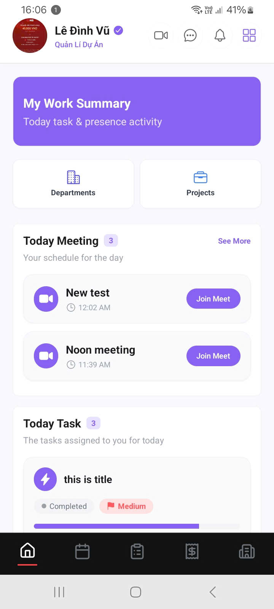
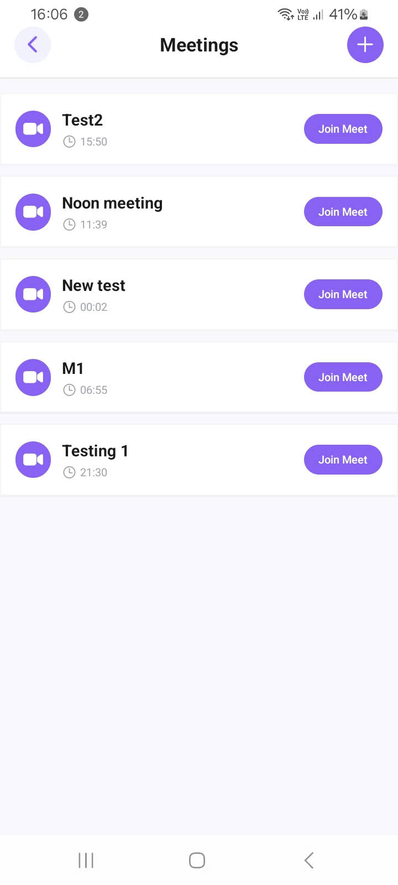
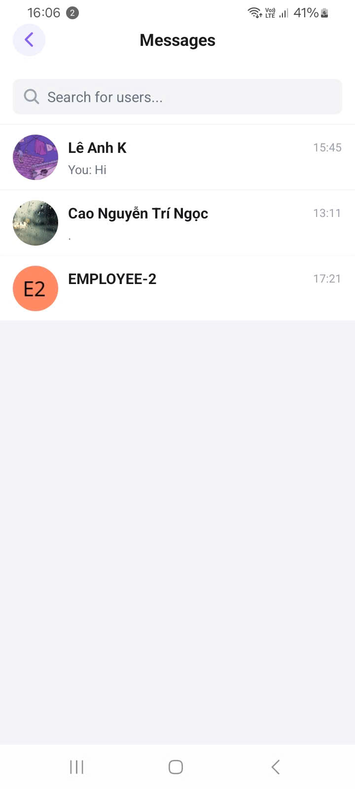
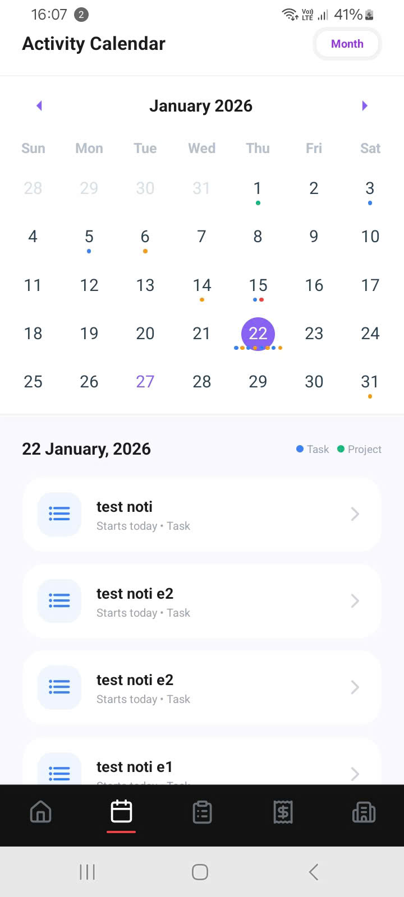
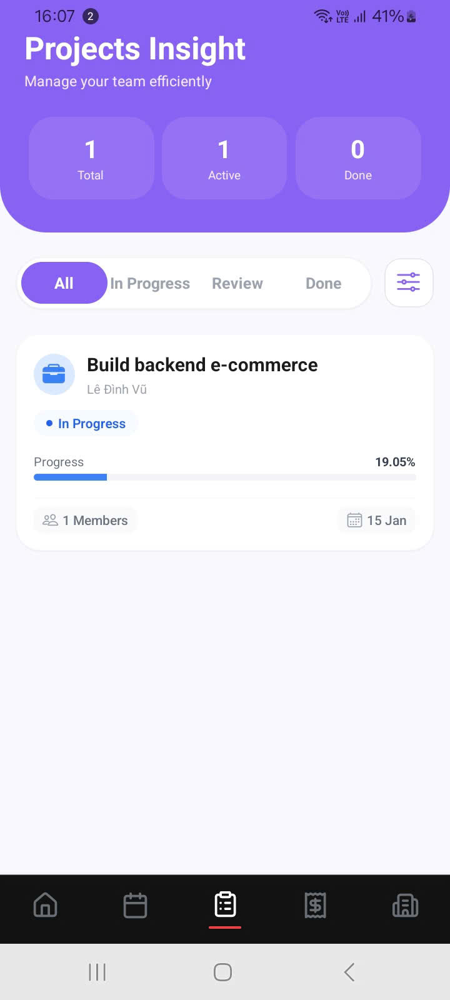
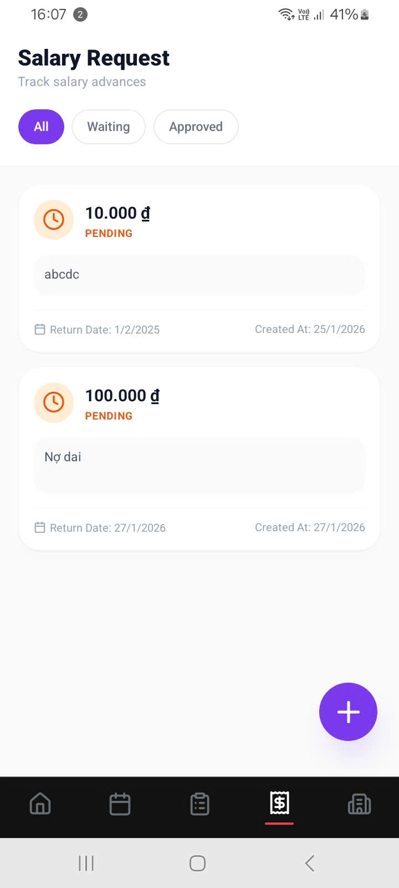
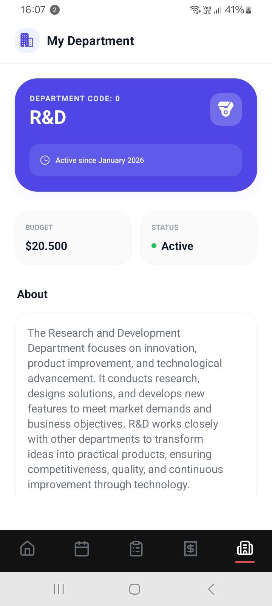

<h1 align="center">CORECHAIN</h1>

<div align="center">
  
</div>

<p align="center">
  <b>Blockchain-Integrated Human Resource Management System</b>
</p>

---

## OVERVIEW

## Abstract

CoreChain represents a *Human Resource Management* solution predicated upon blockchain technology. By leveraging **Distributed Ledger Systems** and **Smart Contracts**, CoreChain guarantees data immutability, verifiability, and integrity, thereby substantially mitigating manual administrative overhead and operational risks.

Designed as a comprehensive, all-encompassing ecosystem, the project integrates disparate corporate management protocols and operational workflows. This consolidation facilitates the optimization of organizational governance and enhances procedural efficiency within the enterprise.

## Mobile Application

This repository constitutes the CoreChain mobile application. Engineered via a cross-platform architecture, the interface is designed to be user-centric for personnel, ensuring accessibility and facilitating seamless integration into daily operations.

---

## MOBILE KEY FEATURES

### Work

1. Task Lifecycle Management, New Task Notification
2. Project Progress Tracking, Project Management
3. Departmental Administration

### Employee Self-Service

1. Personnel Records
2. Internal Feedback System
3. Salary Advance Request
4. Work Schedule & Calendar

### Communication

1. Instant Messaging System
2. Video Conferencing

---

## TECH STACK

### Mobile Application

- **Framework**: React Native (Expo)
- **Language**: TypeScript
- **Routing**: Expo Router
- **Architecture**: Feature-based / Modular
- **Platform**: iOS / Android

---

### Web Application

- **Framework**: Next.js
- **Language**: TypeScript

---

### Backend Services

- **Core Server**: NestJS
- **Communication & Notification Service**: Golang
- **Architecture**: Modular / Microservices-oriented
- **Authentication**: JWT, HTTP-only Cookies

---

### Blockchain Layer

- **Network**: Ethereum Testnet
- **Smart Contract Language**: Solidity
- **Tools**:
  - Truffle
  - Ganache
- **Blockchain SDK**:
  - Web3.js
  - Ethers.js
- **Infrastructure Provider**: Chainstack

---

### Real-time Communication & Notification

- WebSocket
- WebRTC
- Firebase Cloud Messaging (FCM)

---

### Database & Caching

- PostgreSQL – Primary relational database
- MongoDB – Document-based storage
- Redis – Cache, session, queue handling

---

### Message Broker

- Apache Kafka – Event-driven service communication

---

### Deployment & Infrastructure

- AWS EC2
- AWS Application Load Balancer (ALB)
- Render

---

## SYSTEM FUNCTIONAL MODULES

### 1. Identity & Security Module

- User authentication & authorization
- Role-Based Access Control (RBAC)
- Secure session management
- Account locking & forced logout
- Password recovery & security policies

---

### 2. Infrastructure & Core Services

- API Gateway
- Inter-service communication
- Centralized logging & configuration
- Kafka-based event streaming

---

### 3. Human Resource Management (HRM Core)

- Employee profile management
- Organizational structure
- Employment lifecycle tracking
- Blockchain-backed record verification

---

### 4. Task & Workflow Management

- Task assignment & tracking
- Workflow status management
- Audit logs & history

---

### 5. Blockchain & Smart Contract Integration

- Immutable HR records
- Transparent transaction history
- On-chain verification of sensitive operations

---

### 6. Real-time Communication & Notification

- Internal chat & messaging
- Real-time notifications
- Push notifications via FCM

---

## PROJECT STRUCTURE

### Mobile Application (React Native / Expo)

```
.                                   // Project root for CoreChain Mobile (React Native + Expo)
├── GoogleService-Info.plist        // iOS Firebase config (GoogleService-Info.plist)
├── README.md                       // Project README (this file)
├── android                         // Android native project (generated by Expo / React Native)
│   ├── app
│   │   ├── build.gradle            // Android app build configuration
│   │   ├── debug.keystore          // Debug signing key
│   │   ├── google-services.json    // Android Firebase config
│   │   ├── proguard-rules.pro      // ProGuard rules for release builds
│   │   └── src
│   │       ├── debug               // debug source set
│   │       ├── debugOptimized      // optimized debug build sources
│   │       └── main                // main Android source set
│   ├── build.gradle                // Top-level Gradle build file
│   ├── gradle
│   │   └── wrapper
│   │       ├── gradle-wrapper.jar
│   │       └── gradle-wrapper.properties
│   ├── gradle.properties
│   ├── gradlew                     // Gradle wrapper (Unix)
│   ├── gradlew.bat                 // Gradle wrapper (Windows)
│   └── settings.gradle
├── app                             // App routes / screens (expo-router layout)
│   ├── (auth)                      // Auth flow group (sign in / welcome)
│   │   ├── signin.tsx              // Sign-in screen
│   │   └── welcome.tsx             // Welcome/onboarding entry
│   ├── (tabs)                      // Tabbed navigation group
│   │   ├── _layout.tsx             // Tab layout wrapper
│   │   ├── calendar.tsx
│   │   ├── challange.tsx
│   │   ├── department.tsx
│   │   ├── expense.tsx
│   │   └── index.tsx               // Tab landing
│   ├── +not-found.tsx              // 404 / Not found route
│   ├── _layout.tsx                 // App-level layout wrapper
│   ├── changepassword.tsx
│   ├── chat
│   │   └── [id].tsx                // Chat detail (dynamic route by id)
│   ├── create-task.tsx
│   ├── department
│   │   └── index.tsx               // Department listing / detail
│   ├── feedback
│   │   └── index.tsx               // Feedback flow
│   ├── meeting.tsx
│   ├── messages.tsx
│   ├── notifications.tsx
│   ├── personal.tsx
│   ├── personnel
│   │   └── index.tsx               // Personnel list
│   ├── profile.tsx
│   ├── project
│   │   └── index.tsx               // Project list
│   ├── project-details
│   │   └── [id].tsx                // Project detail (dynamic)
│   ├── search-user.tsx
│   ├── task-details
│   │   └── [id].tsx                // Task detail (dynamic)
│   ├── update-profile.tsx
│   ├── versioning.tsx
│   └── video-meeting.tsx           // WebRTC / video meeting screen
├── app.json                        // Expo app config
├── assets
│   └── images
│       ├── android-icon-background.png
│       ├── android-icon-foreground.png
│       ├── android-icon-monochrome.png
│       ├── banner-wellcome.png
│       ├── favicon.png
│       ├── icon.png                // Primary app icon (used by README; update if changed)
│       ├── onboarding-1.png
│       ├── onboarding-2.png
│       ├── onboarding-3.png
│       ├── onboarding-4.png
│       ├── partial-react-logo.png
│       ├── react-logo.png
│       ├── react-logo@2x.png
│       ├── react-logo@3x.png
│       └── splash-icon.png         // Splash screen icon
├── babel.config.js                 // Babel config (JS/TS transpilation)
├── commitlint.config.mjs
├── components                      // Reusable UI components and component groups
│   ├── BottomSheet.tsx             // Generic bottom sheet wrapper
│   ├── BottomSheetModal.tsx
│   ├── InAppNotification.tsx
│   ├── Toast.tsx
│   ├── customs                     // Custom form controls and small components
│   │   ├── Checkbox.tsx
│   │   ├── CustomAlert.tsx
│   │   ├── Input.tsx
│   │   └── LoadingOverlay.tsx
│   ├── external-link.tsx
│   ├── haptic-tab.tsx
│   ├── hello-wave.tsx
│   ├── parallax-scroll-view.tsx
│   ├── screens                     // Feature screen components grouped by feature
│   │   ├── calendar
│   │   │   └── index.tsx
│   │   ├── calendar-working
│   │   │   └── index.tsx
│   │   ├── challange
│   │   │   ├── FilterModal.tsx
│   │   │   ├── ProjectItem.tsx
│   │   │   ├── TaskItem.tsx
│   │   │   ├── TaskItemSkeleton.tsx
│   │   │   └── index.tsx
│   │   ├── changepassword
│   │   │   └── index.tsx
│   │   ├── department
│   │   │   ├── UserDetailModal.tsx
│   │   │   └── index.tsx
│   │   ├── expense
│   │   │   ├── CreateRequestModal.tsx
│   │   │   ├── RequestListSkeleton.tsx
│   │   │   └── index.tsx
│   │   ├── feedback
│   │   │   ├── CreateFeedbackModal.tsx
│   │   │   ├── FeedbackSkeleton.tsx
│   │   │   └── index.tsx
│   │   ├── home
│   │   │   └── index.tsx
│   │   ├── leave
│   │   │   └── index.tsx
│   │   ├── meeting
│   │   │   ├── CreateMeetingModal.tsx
│   │   │   └── index.tsx
│   │   ├── messages
│   │   │   ├── ChatDetail.tsx
│   │   │   ├── EmptyState.tsx
│   │   │   ├── SearchUser.tsx
│   │   │   ├── UserItemSkeleton.tsx
│   │   │   └── index.tsx
│   │   ├── notifications
│   │   │   └── index.tsx
│   │   ├── personal
│   │   │   └── index.tsx
│   │   ├── profile
│   │   │   └── index.tsx
│   │   ├── signin
│   │   │   ├── SignInModal.tsx
│   │   │   └── index.tsx
│   │   ├── task-details
│   │   │   └── index.tsx
│   │   ├── update-profile
│   │   │   └── index.tsx
│   │   ├── versioning
│   │   │   └── index.tsx
│   │   ├── video-meeting
│   │   │   └── index.tsx
│   │   └── welcome
│   │       └── Onboarding.tsx
│   ├── skeletons                    // Loading skeleton components
│   │   ├── DepartmentSkeleton.tsx
│   │   └── ProjectSkeleton.tsx
│   ├── themed-text.tsx
│   ├── themed-view.tsx
│   └── ui
│       ├── collapsible.tsx
│       ├── icon-symbol.ios.tsx     // iOS-specific icon component
│       └── icon-symbol.tsx
├── configs
│   ├── api.ts                       // API endpoints and client config
│   └── route.ts                     // Route definitions used by app
├── constants
│   └── theme.ts                     // Theme constants (colors, spacing)
├── context
│   └── SocketContext.tsx            // WebSocket context provider
├── eas.json                         // Expo Application Services config (builds)
├── eslint.config.js
├── expo-env.d.ts                    // Expo TypeScript environment definitions
├── global.css                       // Shared global styles for web (if used)
├── google-services.json             // Firebase config for Android
├── helpers
│   └── api.ts                       // Thin API helper wrapper
├── hooks                            // Custom React hooks for app logic
│   ├── mutations
│   │   └── index.ts
│   ├── queries
│   │   └── index.ts
│   ├── use-color-scheme.ts
│   ├── use-color-scheme.web.ts
│   ├── use-theme-color.ts
│   ├── useAppState.ts
│   ├── useDebounce.tsx
│   ├── useKeyboard.ts
│   ├── useOnlineManager.ts
│   └── useSocket.ts
├── libs
│   ├── cn.ts                        // classNames helper
│   └── firebase.ts                  // Firebase initialization & helpers
├── metro.config.js                  // Metro bundler config (React Native)
├── mocks                            // Mock data used in development / storybooks
│   ├── departments.ts
│   ├── project.ts
│   ├── salary-request.ts
│   └── task.ts
├── nativewind-env.d.ts
├── package-lock.json
├── package.json                     // npm/Yarn package manifest
├── queue
│   └── task-queue.ts                // Simple in-app task queue utility
├── scripts
│   └── reset-project.js             // Dev helper script to reset local state
├── services                         // Business-layer services (API clients & domain logic)
│   ├── auth.service.ts
│   ├── conversation.service.ts
│   ├── department.service.ts
│   ├── feedback.service.ts
│   ├── file.service.ts
│   ├── firebase.service.ts
│   ├── meeting.service.ts
│   ├── notification.service.ts
│   ├── personnel.service.ts
│   ├── position.service.ts
│   ├── project.service.ts
│   ├── task.service.ts
│   └── user.service.ts
├── stores
│   └── auth-store.ts                // Simple local state store for authentication
├── structure.txt                    // Original tree output (raw)
├── tailwind.config.js               // Tailwind config (if using web)
├── tsconfig.json                    // TypeScript config
├── types                            // Shared TypeScript types/interfaces
│   ├── api.ts
│   ├── common.ts
│   ├── department.ts
│   ├── feedback.ts
│   ├── personnel.ts
│   ├── position.ts
│   ├── project.ts
│   ├── report.ts
│   ├── task.ts
│   └── user.ts
└── utils
    └── axios.ts                     // Preconfigured Axios instance

61 directories, 173 files               // Total (as reported by tree)

```

## DEMO SCREENSHOT / PREVIEW

### 🌐 Landing Page

<div align="center">
  
</div>


### APP

<div align="center">
  
  <br/>

  
  <br/>

  
  <br/>

  
  <br/>

  
  <br/>

  
  <br/>

  
  <br/>
</div>